# YBO Social Network

A full-stack social network: users sign up, post rich-text content, follow each other,
and read a feed that loads as they scroll.

Built as the final project for the Full Stack course.
**React + Vite** frontend · **Flask** API · **MySQL** database.

---

## Quick start

```bash
git clone https://github.com/Yitzhak851/my-app.git
cd my-app
npm start
```

`npm start` checks your prerequisites, installs both sides, creates `.env` files,
builds the database, and starts both servers. It is safe to re-run at any time.

When it finishes you will see:

```text
  Backend  http://localhost:5000
  Frontend http://localhost:5173
```

Open **http://localhost:5173**.

Demo accounts are seeded — sign in with any of them, password `Password123!`:

| Email | Name |
|---|---|
| `dana@example.com` | Dana Levi |
| `omri@example.com` | Omri Cohen |
| `maya@example.com` | Maya Bar |
| `admin@example.com` | Site Admin (role: `admin`) |

### Don't want to install MySQL and Python?

```bash
docker compose up
```

This brings up the database, the API and the frontend together. Nothing but Docker required.

---

## Tech stack

**Frontend** — React 19, Vite 8, React Router 7, Material-UI 9, Quill (rich text),
DOMPurify (HTML sanitizing), Vitest + React Testing Library, Cypress

**Backend** — Python 3.9+, Flask 3, Flask-CORS, mysql-connector-python, bcrypt, python-dotenv

**Database** — MySQL 8 (or 5.7+)

---

## Architecture

```text
Browser
  React SPA (Vite dev server, :5173)
  ├─ AuthContext          session state
  ├─ components/          UI
  └─ api/api.js           all HTTP calls go through here
        │
        │  JSON over HTTP
        ▼
Flask API (:5000)
  ├─ routes/     Blueprints — HTTP concerns only
  ├─ services/   business logic
  ├─ utils/auth  session cookie, @login_required
  └─ utils/db    connection pool + parameterized SQL
        │
        ▼
MySQL
  users · posts · follows · sessions
  likes · comments · reports · password_resets
```

Requests flow **routes → services → database**. Routes never touch SQL and services
never touch the request object, which keeps each layer testable on its own.

---

## Requirements

Install these yourself — the setup script checks for them but will not install
system software on your behalf.

| Software | Version | Needed for | Check |
|---|---|---|---|
| [Node.js](https://nodejs.org) | 18+ | frontend + the setup scripts | `node --version` |
| [Python](https://python.org) | 3.9+ | backend | `python --version` |
| [MySQL](https://dev.mysql.com/downloads/) | 5.7+ | database | `mysql --version` |

On Windows, tick **"Add python.exe to PATH"** in the Python installer.

Verify everything at once:

```bash
npm run doctor
```

If MySQL is missing you can still use the Docker path above.

---

## Environment setup

`npm run setup` creates both `.env` files from their `.env.example` templates.
Existing files are never overwritten.

### `backend/.env`

| Variable | Required | Default | What it does |
|---|---|---|---|
| `FLASK_ENV` | no | `development` | `development` \| `testing` \| `production` |
| `FLASK_DEBUG` | no | `False` | Auto-reload and the debugger. **Never `True` on a server** — the Werkzeug debugger allows remote code execution |
| `HOST` | no | `127.0.0.1` | Interface to bind. Use `0.0.0.0` only behind nginx |
| `PORT` | no | `5000` | API port |
| `DB_HOST` | **yes** | `localhost` | MySQL host |
| `DB_USER` | **yes** | `root` | MySQL user |
| `DB_PASSWORD` | **yes** | — | Your own local MySQL password. Leave empty if your MySQL has none |
| `DB_NAME` | **yes** | `social_app` | Database name — must match `db/schema.sql` |
| `UPLOAD_FOLDER` | no | `backend/uploads` | Where uploaded images are stored |
| `CORS_ORIGINS` | **yes** | `http://localhost:5173` | Comma-separated origins allowed to call the API. Add your deployed frontend origin in production |
| `SECRET_KEY` | **yes** | — | Flask secret. Generate with `python -c "import secrets; print(secrets.token_hex(32))"` |
| `SESSION_COOKIE_SECURE` | no | `False` | Send the session cookie over HTTPS only. **Must be `True` in production**; automatically on when `FLASK_ENV=production` |
| `SESSION_COOKIE_SAMESITE` | no | `Lax` | Cross-site cookie policy |
| `FRONTEND_URL` | no | `http://localhost:5173` | Used to build the link inside the password-reset email |
| `MAIL_BACKEND` | no | `console` | `console` \| `file` \| `smtp`. The default needs no mail server — reset links are printed to the server log |
| `MAIL_FROM` | no | `no-reply@ybo-social.local` | Sender address |
| `MAIL_HOST` / `MAIL_PORT` / `MAIL_USERNAME` / `MAIL_PASSWORD` / `MAIL_USE_TLS` | no | — | Only used when `MAIL_BACKEND=smtp` |
| `AI_PROVIDER` | no | `local` | Backs generation, autocorrect and sentiment. `local` needs no API key |
| `AGENTS_ENABLED` | no | `True` | Run the ten autonomous agents |
| `AGENT_TICK_SECONDS` | no | `45` | Seconds between agent actions |

### `frontend/.env`

| Variable | Required | Default | What it does |
|---|---|---|---|
| `VITE_API_BASE_URL` | **yes** | `http://localhost:5000/api` | Where the frontend sends API calls. Change this when deploying |

> `.env` files are gitignored. Never commit real credentials — put placeholders in
> `.env.example` instead.

---

## Database setup

`npm run setup` does this automatically. To do it manually:

```bash
mysql -u root -p < db/schema.sql
mysql -u root -p < db/seed.sql     # optional demo data
```

| File | Contents |
|---|---|
| `db/schema.sql` | Database, tables, columns, indexes and foreign keys. **Re-runnable and non-destructive** — safe against a database that already holds real data |
| `db/seed.sql` | Demo users, posts, follows, likes and comments. Re-runnable |
| `db/erd.mmd` | Diagram source (Mermaid) |
| `db/erd.svg` | Rendered diagram — **the deliverable for requirement 1.f** |
| `db/erd.html` | The same diagram as a standalone page |

`schema.sql` is written as a migration, not just a definition. Running it against
an existing database adds only what is missing: new tables, new columns, missing
indexes, and it upgrades old foreign keys to `ON DELETE CASCADE`. Nothing is
dropped and no rows are lost. Only `npm run db:reset` is destructive.

### Schema



Regenerate the diagram after editing `db/erd.mmd`:

```bash
npm run db:diagram
```

| Table | Holds | Course requirement |
|---|---|---|
| `users` | Accounts, plus `role`, `is_agent` and `personality` | 1.a, 1.b, 2.d, 2.e.i |
| `posts` | Rich-text posts, with moderation flags | 1.e |
| `follows` | Who follows whom | 1.c.ii |
| `sessions` | Server-side sessions; the client holds only an opaque token | 1.a.i |
| `likes` | One row per user per post | 2.b.i |
| `comments` | Flat, with `parent_id` for one level of replies | 2.b.ii |
| `reports` | Flagged posts and comments for the moderator queue | 2.e.ii |
| `password_resets` | SHA-256 of reset tokens, never the token itself | 2.a.i |

All foreign keys use `ON DELETE CASCADE`, so removing a user removes their posts,
comments, likes, sessions and follow relationships rather than leaving orphans.

---

## Available scripts

Run from the project root.

| Command | What it does |
|---|---|
| `npm start` | Setup, then run both servers. **The one command** |
| `npm run setup` | Prerequisites, dependencies, `.env` files, database. Idempotent — a repeat run takes about a second because it skips work that is already done |
| `npm run setup -- --reinstall` | Force a clean `npm ci`, e.g. after a broken install |
| `npm run dev` | Run backend + frontend together (assumes setup is done) |
| `npm run doctor` | Check prerequisites only. Changes nothing |
| `npm test` | Run both test suites, with coverage, and fail if either drops below 85% |
| `npm run build` | Production build of the frontend into `frontend/dist` |
| `npm run db:doctor` | Diagnose a MySQL connection problem. Reads nothing secret, writes nothing |
| `npm run db:init` | Apply schema + seed only |
| `npm run db:reset` | **Drop** the database and rebuild it from scratch |
| `npm run db:diagram` | Re-render `db/erd.svg` from `db/erd.mmd` |
| `npm run db:probe` | Test the database connection through the Flask app's own client |
| `npm run agents:seed` | Create the ten agent accounts. Run automatically by setup |
| `npm run verify` | Walk the running app in a real browser, 33 checks. Needs the servers up and `npm i -D playwright` |

Frontend-only (run inside `frontend/`):

| Command | What it does |
|---|---|
| `npm run dev` | Vite dev server |
| `npm run test` | Vitest with coverage (fails under the thresholds) |
| `npm run test:fast` | Vitest without coverage — quicker while writing a test |
| `npm run test:watch` | Vitest, watch mode |
| `npm run test:coverage` | Vitest with a coverage report |
| `npm run test:e2e` | Cypress end-to-end tests |
| `npm run lint` | ESLint |

---

## Testing

```bash
npm test          # both suites, with coverage, from the project root
```

| Suite | Tests | Statement coverage |
|---|---|---|
| Backend (pytest) | 302 | 94% |
| Frontend (Vitest + React Testing Library) | 208 | 90% |
| **Total** | **510** | — |

Course requirement 2.f asks for 85%. The threshold is enforced rather than
reported: `backend/pytest.ini` sets `--cov-fail-under=85` and
`frontend/vitest.config.js` sets coverage thresholds, so coverage dropping
below the target turns the run red. `npm test` prints both numbers in its
summary.

**What the tests are for.** Each one is named after the behaviour it protects,
and where a test exists because something actually broke, the comment says what
broke. A few examples:

- `backend/tests/test_cors.py` — reads the verbs the app's own URL map declares
  and requires each to survive a preflight. PATCH was missing from the CORS
  allow-list, so the Dismiss button in the moderation dashboard did nothing:
  server healthy, endpoint fine from curl, unit tests green, nothing in the log.
- `backend/tests/test_error_paths.py` — one property applied to every endpoint:
  during a database outage, answer cleanly and say nothing about MySQL, the
  schema or the SQL. It found four endpoints returning `str(exception)`.
- `backend/tests/test_db_pool.py` — drives the real pool against a fake driver,
  including 20 concurrent operations, because a single shared connection is what
  produced `2014 (HY000): Commands out of sync`.
- `frontend/src/tests/apiClient.test.js` — one row per exported call, checking
  the verb, the URL and that `credentials: "include"` is set. A dropped
  credentials flag is invisible until something needs authentication.

**Database in the backend suite.** `backend/tests/conftest.py` swaps the
`Database.execute_*` entry points for an in-memory fake, so routes, services and
decorators all run for real with no MySQL server, no fixture data to reset and
no ordering between tests.

### The browser walkthrough

The suites above mock the network. `npm run verify` does not — it drives
Chromium against the running servers and the real database, and it is what
catches the bugs that only exist once the pieces are wired together.

```bash
npm i -D playwright && npx playwright install chromium   # once
npm start                                                # in one terminal
npm run verify                                           # in another
```

33 checks: sign up, publish, like, comment, follow, report, moderate, ban,
the agents, grid layout, phone width, and sign-out. Each prints PASS or FAIL and
the script exits non-zero if any fail.

---

## Project structure

```text
my-app/
├── package.json            root scripts — the entry point
├── docker-compose.yml      full environment in containers
│
├── db/
│   ├── schema.sql          tables, keys, indexes (re-runnable migration)
│   ├── seed.sql            demo data
│   ├── erd.mmd             diagram source
│   ├── erd.svg             rendered diagram (requirement 1.f)
│   └── erd.html            diagram as a standalone page
│
├── scripts/
│   ├── setup.mjs           prerequisites, install, configure, database
│   ├── db-doctor.mjs       diagnose a MySQL connection problem
│   ├── db-diagram.mjs      render the ER diagram
│   ├── dev.mjs             runs both servers with one Ctrl+C
│   ├── test.mjs            runs both test suites with coverage
│   ├── run-backend.mjs     runs a command inside the backend venv
│   └── lib/env.mjs         shared helpers (no npm dependencies)
│
├── tools/
│   └── regression.mjs      the browser walkthrough — npm run verify
│
├── backend/
│   ├── run.py              entry point
│   ├── requirements.txt
│   ├── pytest.ini
│   ├── tests/              pytest suite (auth, permissions, uploads, privacy,
│   │                       moderation, AI, the pool, CORS, outage behaviour)
│   ├── uploads/            user-uploaded images (gitignored)
│   ├── tools/db_probe.py   connection diagnostics
│   ├── Dockerfile
│   └── app/
│       ├── __init__.py     app factory, CORS, error handlers
│       ├── config/         environment-based configuration
│       ├── models/         data shapes
│       ├── routes/         Blueprints: auth, posts, users, follows, uploads
│       ├── services/       business logic (session, upload, posts, users, follows)
│       ├── utils/db.py     connection pool + parameterized SQL
│       ├── utils/errors.py log the real cause, return a safe message
│       └── utils/auth.py   @login_required, @admin_required, session cookie
│
└── frontend/
    ├── package.json
    ├── vite.config.js      build config
    ├── vitest.config.js    test config
    ├── Dockerfile
    ├── cypress/            end-to-end tests
    └── src/
        ├── api/api.js      every HTTP call
        ├── auth/           AuthContext + ProtectedRoute
        ├── components/     UI components
        └── tests/          unit tests
```

---

## API

Base URL: `http://localhost:5000/api`

### What the API does not return

Email addresses are never included in public responses — not in the user list,
not on a profile, not with a post. `GET /auth/me` returns your own. The search
box matches usernames only; matching email as well turned it into an
address-harvesting tool.

### Moderation and AI

**Reporting and roles.** Anyone signed in can report a post or a comment.
`users.role` is one of `user`, `moderator` or `admin`: moderators work the
queue, ban accounts and delete content; only admins hand out roles. The
dashboard is at `/admin`, and the server enforces the same rules the UI does.

**Sentiment.** Posts and comments are scored when they are written. Content
that reads as an attack on a person is flagged for review — it is still
published, and a moderator decides. Ordinary negativity is deliberately **not**
flagged: "this build failed and it's awful" is frustration with software, and a
queue full of that is a queue nobody reads.

The scorer is a lexicon, not a model. It catches blunt hostility in English and
nothing subtler, which is exactly why a flag is a hint rather than a verdict,
and why the report button exists alongside it.

**Agents.** Ten accounts with distinct personalities post, reply and like on a
timer, driven by the `personality` stored on their user row. They run inside the
backend process — no second service to start.

**Writing help.** The composer offers a draft, a spelling pass and a tone check.
All three are suggestions; none of them rewrite anything on their own or block
publishing.

All of it runs through one `AIProvider` interface with a local, template-based
implementation. Swapping in a hosted model means adding one subclass and setting
`AI_PROVIDER` — nothing that calls it changes.

### Password reset

There is no mail server in a course project, so `MAIL_BACKEND=console` prints
the email — reset link included — straight to the terminal running the backend.
The flow is otherwise the real one, and switching to `smtp` is a config change.

Only the SHA-256 of a reset token is stored, never the token, so a stolen
database cannot be used to reset anyone's password. A token expires after 30
minutes, works once, and completing a reset ends every existing session for
that account.

### Uploads

Posts can carry a real uploaded image. Files are validated by their leading
bytes rather than their extension, stored under a random name, capped at 5 MB,
and served from `/static/uploads/`. SVG is rejected on purpose: it can contain
`<script>`, and serving one from our own origin would be stored XSS.

Uploaded files live in `backend/uploads/`, which is gitignored — user content is
not source code.

### Authentication

Sessions are stored server-side in the `sessions` table, exactly as the course
teaches. Signing in sets an **HttpOnly** cookie holding an opaque random token;
JavaScript cannot read it, so an XSS bug cannot steal a session.

**Identity always comes from that cookie, never from the request body.** Sending
`userId` or `follower_id` has no effect — the server ignores it. Reading is
public (the global feed and profiles work signed out); writing is not.

Because the dev frontend (`:5173`) and API (`:5000`) are different origins, the
browser only sends the cookie when the request sets `credentials: "include"`
and the API replies with `supports_credentials`. Both are configured; if you add
a new origin, add it to `CORS_ORIGINS`.

| Method | Endpoint | Purpose |
|---|---|---|
| `GET` | `/health` | Service check |
| `POST` | `/auth/signup` | Create an account and start a session |
| `POST` | `/auth/login` | Sign in — sets the `session_id` cookie |
| `POST` | `/auth/logout` | End the session server-side and clear the cookie |
| `POST` | `/auth/forgot-password` | Email a reset link. Always answers 200, whether or not the address exists |
| `POST` | `/auth/reset-password` | Set a new password using the emailed token |
| `GET` | `/auth/me` | The signed-in user. `401` when signed out |
| `GET` | `/posts/` | Feed. `?start&limit&userId&followingOnly` — public |
| `POST` | `/posts/` | Create a post. **Requires a session**; the author is the signed-in user |
| `POST` | `/uploads/image` | Upload one image (multipart, field `image`). **Requires a session**. Returns `{url, filename}` |
| `GET` | `/users/` | List users, or search **by username**. `?start&limit&search` |
| `GET` | `/users/<id>` | One user |
| `GET` | `/users/<id>/follow-stats` | Follower, following and post counts |
| `POST` | `/follows/` | Follow a user. **Requires a session** |
| `DELETE` | `/follows/` | Unfollow a user. **Requires a session** |
| `GET` | `/follows/check` | Is the signed-in user following `?following_id`. **Requires a session** |
| `GET` | `/follows/<id>/followers` | Who follows this user |
| `GET` | `/follows/<id>/following` | Who this user follows |
| `POST` | `/posts/<id>/like` | Like a post. **Requires a session**. Liking twice is a no-op |
| `DELETE` | `/posts/<id>/like` | Remove your like. **Requires a session** |
| `GET` | `/posts/<id>/comments` | Comments on a post — public |
| `POST` | `/posts/<id>/comments` | Add a comment. **Requires a session** |
| `DELETE` | `/comments/<id>` | Delete your own comment; moderators may delete any |
| `POST` | `/reports` | Flag a post or comment. **Requires a session** |
| `GET` | `/moderation/queue` | Open reports. **Moderators** |
| `GET` | `/moderation/flagged` | Automatically held content. **Moderators** |
| `PATCH` | `/moderation/reports/<id>` | Close a report. **Moderators** |
| `DELETE` | `/moderation/posts/<id>` | Remove a post. **Moderators** |
| `POST` | `/moderation/users/<id>/ban` | Ban or unban. **Moderators** |
| `POST` | `/moderation/users/<id>/role` | Change a role. **Admins only** |
| `POST` | `/ai/autocorrect` | Spelling suggestions |
| `POST` | `/ai/generate-post` | A draft to start from |
| `GET` | `/ai/suggest-comments/<id>` | Reply suggestions for a post |
| `POST` | `/ai/analyze` | Tone check before publishing |

---

## Troubleshooting

**`npm start` says Python is not found (Windows)**
Python was installed without being added to PATH. Re-run the installer, choose
*Modify*, and enable *Add python.exe to PATH*. Then open a new terminal.

**`cannot connect to MySQL`**
The server isn't running, or `DB_PASSWORD` in `backend/.env` is wrong. Test your
credentials directly with `mysql -u root -p`. Or skip MySQL entirely with `docker compose up`.

**`could not create the virtualenv` (Linux)**
`sudo apt install python3-venv`

**Port 5000 or 5173 already in use**

```bash
# Windows
netstat -ano | findstr :5000
taskkill /PID <PID> /F

# macOS / Linux
lsof -ti:5000 | xargs kill -9
```

Or change `PORT` in `backend/.env`.

**Frontend loads but shows no posts**
The API isn't reachable. Check `http://localhost:5000/api/health` in your browser,
confirm `VITE_API_BASE_URL` in `frontend/.env`, and look for CORS errors in the
browser console — the frontend's origin must appear in `CORS_ORIGINS`.

**The database is in a bad state**

```bash
npm run db:reset
```

This drops and rebuilds it. All data is lost.
